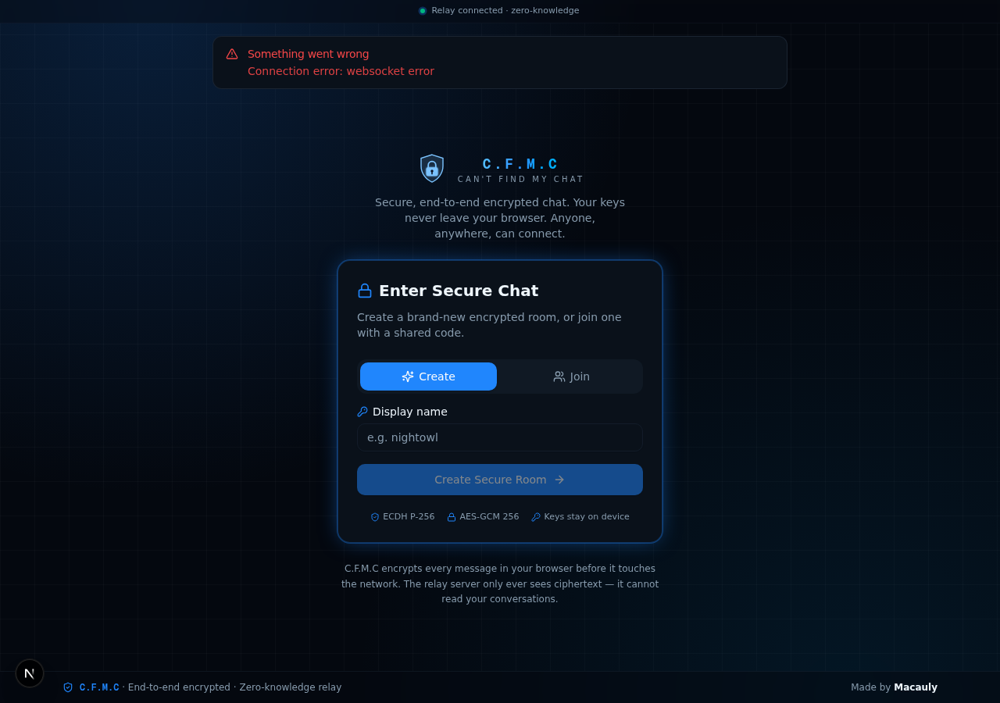
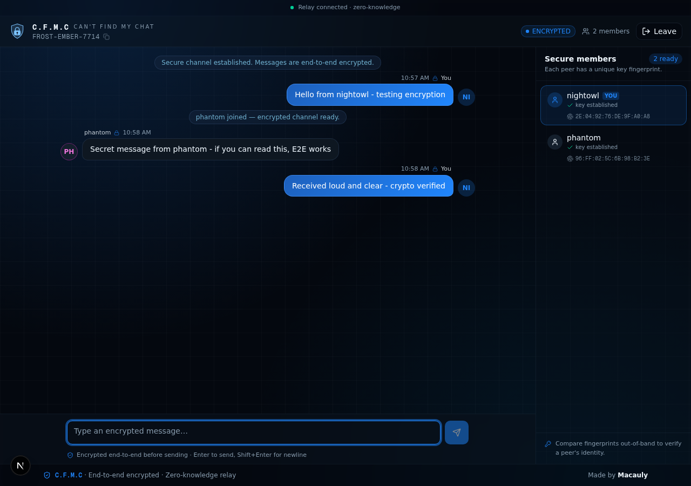
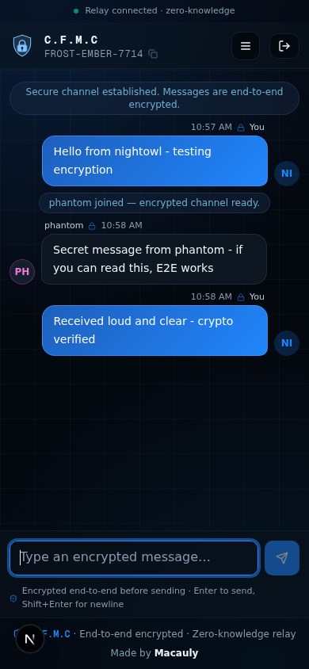

# C.F.M.C — Can't Find My Chat

> A secure, end-to-end encrypted chat application. Messages are encrypted in your browser **before** they ever leave your device — the server cannot read them.

**Made by Macauly**

---

## What is it?

C.F.M.C (Can't Find My Chat) is a real-time, end-to-end encrypted chat app. Anyone in the world can create a room, share the code, and communicate securely — no account, no phone number, no server-side access to your conversations.

The server is a **zero-knowledge relay**: it forwards encrypted blobs between members and holds **no private keys and no plaintext**.

---

## Screenshots

<p align="center">
  
  &nbsp;
  
</p>
<p align="center">
  
</p>

---

## How the encryption works

This is genuine public-key cryptography running natively in the browser via the **Web Crypto API** — not obfuscation.

| Layer | Algorithm | Purpose |
|---|---|---|
| Key exchange | **ECDH P-256** | Each client generates a keypair locally. The private key never leaves the device. |
| Message encryption | **AES-GCM 256-bit** | A shared symmetric key is derived for every peer. Each message uses a fresh random 96-bit IV. |
| Identity verification | **SHA-256** | Each member gets a short, human-verifiable key fingerprint. |

**Security model:**

1. On first load, your browser generates an ECDH P-256 keypair. The private key is persisted in `localStorage` (and can be wiped at any time).
2. Your public key is shared with peers via the relay.
3. For every peer, a shared AES-GCM key is derived using ECDH (`A.derive(B.pub) === B.derive(A.pub)`).
4. When you send a message, it is encrypted **once per recipient** under their own shared key, with a fresh IV, *before* it touches the network.
5. The relay forwards the ciphertext verbatim. It never decrypts, never inspects payload bytes, and holds no private keys.

> The relay log proves this: it only ever records room joins — never message contents.

---

## Features

- 🔐 **End-to-end encryption** — ECDH P-256 + AES-GCM 256, fully client-side
- 🌍 **Global access** — share a room code, anyone can join from anywhere
- 🕵️ **Zero-knowledge relay** — the server cannot read your messages
- 🔑 **Device-bound keys** — private keys never leave your browser
- 🧬 **Key fingerprints** — verify a peer's identity out-of-band
- 🎨 **Black & blue themed UI** with responsive mobile layout
- ⚡ **Real-time** over WebSockets (socket.io)
- 🚫 **No accounts, no tracking, no database**

---

## Tech stack

- **Next.js 16** (App Router) + **TypeScript**
- **Tailwind CSS 4** + **shadcn/ui**
- **socket.io** for real-time transport
- **Web Crypto API** for all cryptography
- The relay runs **inside the Next.js process** (started lazily via an API route) — no separate service to manage

---

## Quick start

### Prerequisites

- [Bun](https://bun.sh) (recommended) or Node.js 20+
- Any modern browser (Chrome, Edge, Firefox, Safari)

### Run locally

```bash
git clone https://github.com/<your-username>/cfmc.git
cd cfmc
bun install
bun run dev
```

Then open **http://localhost:3000**, create a room, and share the code.

The encrypted relay starts automatically inside the app — there is no separate process to launch.

---

## Let anyone in the world reach it

Because the relay listens on a separate port (3003), remote browsers need a single entry point. Use **Caddy** (included: `Caddyfile.windows`):

```bash
# 1. Keep the app running
bun run dev

# 2. In a second terminal, run Caddy
caddy run --config Caddyfile.windows
```

Then expose port 80 via **ngrok** (simplest):

```bash
ngrok http 80
```

Share the resulting `https://*.ngrok.app` URL with anyone. The app auto-detects remote access and routes the websocket through Caddy — no code changes required.

> **Cloudflare Tunnel** (`cloudflared tunnel --url http://localhost:80`) works equally well and has no signup limits.

---

## Project structure

```
src/
├── lib/
│   ├── crypto.ts          # ECDH + AES-GCM core (Web Crypto API)
│   ├── chat-protocol.ts   # Wire protocol types
│   └── relay.ts           # Zero-knowledge socket.io relay
├── hooks/
│   └── use-secure-chat.ts # Identity, key exchange, encrypt/decrypt
├── components/chat/        # Join screen, chat room, members, composer
├── app/
│   ├── api/relay/route.ts # Lazy relay bootstrap
│   ├── page.tsx           # Join → chat state machine
│   └── layout.tsx
└── instrumentation.ts     # Starts relay on server boot
```

---

## Security notes & honest caveats

- This is **real cryptography**, but it is a personal project — **not an audited messenger**. For high-stakes privacy, use Signal or a similarly audited tool.
- The relay does not persist messages; if a peer is offline when you send, they will not receive it. (There is no message store by design — storing messages would weaken the zero-knowledge property.)
- Key fingerprints exist so you can verify identity out-of-band. **Use them** if authenticity matters.
- Your private key lives in `localStorage`. Clearing your browser data generates a new identity.

---

## Credits

**Designed and built by Macauly.**

Encryption via the Web Crypto API. UI built with shadcn/ui.

---

## Licence

Released under the **MIT Licence**. See [`LICENSE`](./LICENSE).

> C.F.M.C — Can't Find My Chat. Because if the server can't find your chat, neither can anyone else.
